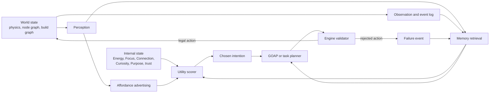
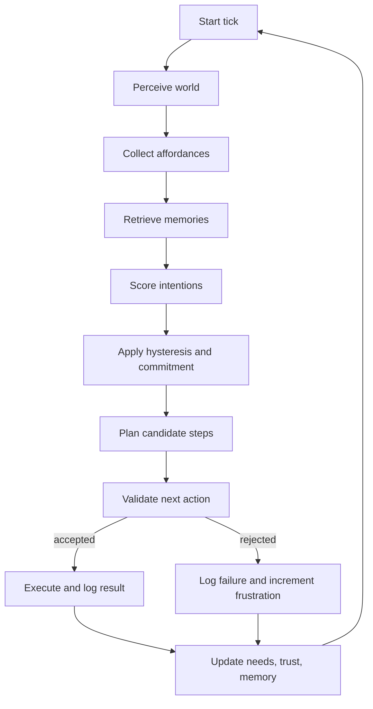
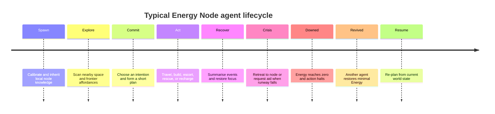

# Designing an Emergent Motivator System for Energy Node Agents

## Executive summary

The strongest design for virtual agents whose survival depends on Energy Nodes is a **hybrid architecture**: **needs-based internal state → utility scoring → planner → deterministic world validator**, with behaviour trees used only where they help execute low-level action logic, and with large language models kept off the critical control loop except for reflection, summarisation, dialogue, or occasional high-level suggestions. This recommendation is the point where the most relevant strands of the literature converge: needs-based AI explains how competing drives produce legible action pressure; utility AI shows how to compare heterogeneous needs with normalised response curves; GOAP shows how agents can compose action sequences dynamically rather than follow brittle scripts; and Concordia demonstrates why world outcomes should be adjudicated by a separate grounded “Game Master” or validator rather than by the agent alone. citeturn9view0turn28view1turn32view0turn31view2

For an Energy Node world, emergence should come primarily from **resource topology, local affordances, bounded perception, memory, and commitment**, not from unconstrained language generation. Zubek’s needs-based model is especially important here because it places “advertisements” in the world, letting nearby objects and situations offer actions that the agent scores against its current needs. Orkin’s planning work then explains how those selected intentions can be converted into sequences that adapt to failure through re-planning. Generative Agents and Concordia add the missing higher-level pieces: memory, reflection, and grounded adjudication. citeturn10view0turn10view1turn31view0turn31view2

The main reason **not** to use a pure LLM controller is that the recent evaluation literature still shows significant weaknesses in sustained collaboration and adaptation. Collab-Overcooked reports that contemporary LLM agent systems tend to interpret goals well but still fall short on active collaboration and continuous adaptation. The Concordia contest evaluation likewise finds substantial gaps between current agent capabilities and the level of robust generalisation needed for reliable cooperation in mixed-motive settings. citeturn23view1turn18view0

The main reason **not** to begin with pure reinforcement learning is that it imposes a large training and reward-design burden while generalisation to new partners and environments remains a central open problem. Melting Pot was created precisely to test generalisation to unfamiliar social situations, and its authors report that maximising collective reward can still produce policies that are less robust to novel social situations than policies trained with different incentives. Overcooked-AI and the Overcooked Generalisation Challenge similarly show that coordination with held-out partners and layouts is a harder and more relevant target than in-distribution self-play. citeturn10view3turn22view2turn11view7turn10view4

For a browser-hosted simulation built with **Vite, Three.js, and Rapier**, the recommended MVP is therefore a deterministic simulation core with low-frequency utility/planning ticks, a symbolic affordance/planning layer sitting above continuous physics, and optional asynchronous memory summarisation. That architecture fits the documented positioning of Vite as a fast web build tool, Three.js as a lightweight browser 3D library, and Rapier as a web-supported physics engine. citeturn14view1turn5search3turn13view7

## Research landscape and primary sources

The relevant literature divides neatly into four functional questions. **First**, how should an agent represent competing motives? Needs-based AI is the clearest direct answer. **Second**, how should the agent decide what matters now? Utility modelling offers the best control surface. **Third**, how should the agent work out how to act? GOAP and related planners remain the most practical answer for authored embodied worlds. **Fourth**, what additional machinery makes multi-agent behaviour look social rather than merely reactive? That is where memory, reflection, partner generalisation, and emergent-convention studies become useful. citeturn9view0turn28view3turn32view0turn31view0turn12view4turn22view2

Each citation in the table below is a clickable link to the primary paper or official project page.

| Priority | Primary source | Why it matters for this problem | Official implementation or venue |
|---|---|---|---|
| Essential | Robert Zubek, *Needs-Based AI*. citeturn0search0turn9view0 | The clearest practical statement of competing internal needs, world “advertisements”, action queues, and scoring actions against internal state. | Final draft publication page. citeturn0search0 |
| Essential | Dave Mark and Kevin Dill, *Improving AI Decision Modeling Through Utility Theory*. citeturn2search2turn28view3 | Establishes the practical utility-AI pattern: convert raw values into normalised concepts, compare competing interests, use response curves, and rank actions. | GDC AI Summit slides. citeturn2search2 |
| Essential | Jeff Orkin, *Agent Architecture Considerations for Real-Time Planning in Games* and *Three States and a Plan*. citeturn32view0turn10view1 | The canonical game-AI case for GOAP: real-time planning, re-planning after failure, modular action definitions, and CPU-aware architecture. | Official AAAI proceedings page and GDC talk PDF. citeturn32view0turn0search1 |
| High | Michele Colledanchise and Petter Ögren, *Behavior Trees in Robotics and AI*; Matteo Iovino et al., *A Survey of Behavior Trees in Robotics and AI*. citeturn11view0turn12view5 | The best references for BT strengths: modularity, reactivity, and maintainability, plus the historical reason BTs displaced poorly-scaling FSMs. | arXiv papers. citeturn2search1turn2search5 |
| Essential | Park et al., *Generative Agents: Interactive Simulacra of Human Behavior*. citeturn31view0 | Memory, reflection, and planning as the ingredients behind believable social behaviour; shows emergent social coordination from local interactions. | Official paper page and Stanford project page. citeturn2search0turn2search11 |
| Essential | Vezhnevets et al., *Generative agent-based modeling with actions grounded in physical, social, or digital space using Concordia*. citeturn31view2 | The closest match to a validator architecture: agents state intentions; a Game Master checks plausibility, resolves outcomes, and updates grounded state. | Official paper and official repository. citeturn4search0turn22view0 |
| High | Smith et al., *Evaluating Generalization Capabilities of LLM-Based Agents in Mixed-Motive Scenarios Using Concordia*. citeturn18view0 | Strong evidence that current LLM agents still struggle with robust cooperation and generalisation in held-out mixed-motive scenarios. | OpenReview benchmark paper; official Concordia code URL in paper. citeturn18view0turn22view0 |
| High | Leibo et al., *Scalable Evaluation of Multi-Agent Reinforcement Learning with Melting Pot*. citeturn13view0turn22view2 | The best benchmark framing for partner/context generalisation, social dilemmas, and coordination robustness. | Official paper and official repository. citeturn1search18turn21view0 |
| High | Carroll et al., *On the Utility of Learning about Humans for Human-AI Coordination*; Ruhdorfer et al., *The Overcooked Generalisation Challenge*. citeturn11view7turn10view4 | Strong evidence that coordination policies trained for themselves or fixed layouts do not necessarily generalise to humans, new partners, or new levels. | Official paper and official Overcooked-AI repo. citeturn7search4turn14view5 |
| Medium | Wang et al., *Voyager: An Open-Ended Embodied Agent with Large Language Models*. citeturn12view3turn25view2 | Important for the ideas of an automatic curriculum, iterative feedback, and a reusable executable skill library. | Official project site and official repository. citeturn1search5turn25view1 |
| Medium | Piao et al., *AgentSociety*. citeturn12view2 | Valuable for large-scale simulation lessons: LLM-driven agents, realistic social environment, simulation engine, and replayable experiments. | Official repository and docs. citeturn25view0 |
| Medium | Ashery et al., *Emergent social conventions and collective bias in LLM populations*. citeturn12view4 | Useful if you want norms, naming conventions, and local conventions to emerge from repeated social interaction rather than manual scripting. | Official paper and Science Advances record. citeturn3search0turn12view4 |

Taken together, these sources imply a useful separation of concerns. **Needs and utility** should choose what matters; **planning** should compose action sequences; **validation** should decide what is legal and physically grounded; **memory** should preserve continuity; and **evaluation** must test held-out partners and situations rather than only average reward in familiar conditions. citeturn9view0turn28view3turn32view0turn31view0turn31view2turn22view2turn10view4

## Architecture comparison

The table below is an implementation synthesis rather than a direct quotation of any one paper. The ratings combine the literature above with the practical constraints of a browser-hosted TypeScript simulation using Vite, Three.js, and Rapier. citeturn9view0turn28view3turn32view0turn11view0turn19view0turn14view1turn5search3turn13view7

| Architecture | Advantages | Drawbacks | Implementation complexity | Runtime compute | Determinism | Emergent potential | Suitability for a Vite/Three/Rapier build | Representative evidence |
|---|---|---|---|---|---|---|---|---|
| **Needs → utility → planner → validator** | Interpretable; designer-controllable; supports local emergence; handles resource scarcity well; planner can discover novel action sequences; validator keeps physics/legal state grounded | Requires careful score shaping; affordances must be authored; no automatic policy improvement unless learning is added later | Medium to high | Low to medium | High | High | **Excellent** | citeturn9view0turn28view3turn32view0turn31view2 |
| **Pure LLM controller** | Flexible language reasoning; good for dialogue and open-ended social improvisation; easy to prototype with natural-language prompts | Token cost and latency; low reproducibility; illegal or physically impossible actions must still be checked externally; struggles with strong collaboration and adaptation in current benchmarks | Medium to start, high to stabilise | High | Low | Medium to high socially, but unreliable for embodied control | **Poor as the main controller; useful only as an optional upper layer** | citeturn31view0turn31view2turn18view0turn23view1 |
| **Behaviour trees only** | Fast, modular, reactive, debuggable, highly deterministic | Authoring burden grows combinatorially; weaker at discovering novel multi-step solutions unless heavily augmented | Low to medium | Low | Very high | Low to medium | **Good for execution, insufficient as the whole brain** | citeturn11view0turn12view5 |
| **Reinforcement learning or MARL** | Can discover non-obvious policies; useful in fixed repeated tasks; inference can be cheap after training | High training cost; reward design is difficult; poor interpretability; generalisation to novel partners/layouts remains hard | High | Very high during training, low at inference | Medium | High in principle, variable in practice | **Moderate as an offline supplement, weak as a first browser MVP** | citeturn19view0turn22view2turn11view7turn10view4 |

The most important nuance is that **behaviour trees and reinforcement learning are not rejected entirely**. BTs are excellent for low-level action execution once a goal has been chosen, and RL can be useful later for policy distillation, local navigation heuristics, or balancing parameters. What the literature does **not** support is starting with either of them as the whole architecture if your immediate goal is controllable emergent behaviour in an embodied multi-agent world. citeturn11view0turn12view5turn19view0turn22view2turn10view4

The browser constraint also matters. Orkin explicitly notes that real-time planning must share CPU with physics, animation, and rendering, so caching and supporting architecture are essential. That concern is even sharper in a web stack, where render smoothness matters and long synchronous planning spikes are conspicuous. Vite’s fast development workflow helps iteration, Three.js provides the rendering substrate, and Rapier gives you a physics core with web support; but those tools do not remove the need for a low-frequency, budgeted decision loop. citeturn32view0turn14view1turn5search3turn13view7

## Reference design for Energy Node agents

The design target is not “intelligence” in the abstract. It is **persistent, socially legible, resource-constrained behaviour** in a world where Energy Nodes create survival radii, travel risk, and mixed-motive public-good decisions. The most reliable way to obtain that is to make **survival a hard constraint**, to let **secondary needs create pressure**, to let **utility choose intentions**, to let **GOAP compose steps**, and to let a **deterministic validator** accept or reject the next concrete action. That division closely follows the most robust elements of needs-based AI, utility AI, GOAP, Generative Agents, and Concordia. citeturn9view0turn28view3turn32view0turn31view0turn31view2



A good Energy Node world should be built around a **dual representation**. The first representation is continuous and physical: positions, collisions, line of sight, hazards, and movement constraints. The second is symbolic and planning-friendly: known nodes, route graph, frontier tiles, blocked edges, legal build sites, downed agents, and candidate cooperation opportunities. Orkin’s planning work depends on symbolic world state; Concordia shows the same grounded/symbolic split through Game Master variables and action resolution. citeturn32view0turn31view2

| State variable | Type | What it means | Typical update rule | Why it matters |
|---|---|---|---|---|
| `energy` | `0..Emax` | Hard survival resource | Decays on time, movement, building; rises near active nodes or transfers | Survival cannot be just another preference |
| `energyRunway` | derived | Estimated safe surplus after return-to-node cost | `energy - estimatedReturnCost(nearestKnownNode)` | Converts raw energy into risk-aware urgency |
| `focus` | `0..100` | Confidence and continuity of the current plan | Falls after interruptions/failures; rises through progress or recalibration | Reduces thrashing and supports coherent tasks |
| `connection` | `0..100` | Social fulfilment | Falls with isolation; rises through meaningful interaction and shared work | Produces helping, following, and partner choice |
| `curiosity` | `0..100` | Novelty fulfilment | Falls in over-familiar contexts; rises after exploration/discovery | Drives frontier exploration |
| `purpose` | `0..100` | Project fulfilment | Falls when idle or abandoning commitments; rises with visible task progress | Drives building, repair, and node activation |
| `trust[agentId]` | `-1..1` | Partner-specific expectation | Updated from successful help, broken commitments, free-riding, rescue | Enables partner selection and reciprocity |
| `commitment` | `0..1` | How strongly the agent should continue a current intention | Rises with progress; drops when blocked or invalidated | Adds hysteresis |
| `frustration` | `0..1` | Recent failure load | Rises on repeated rejection/failure; decays slowly | Supports retreat, recalibration, or help-seeking |

The **needs layer** should distinguish between survival and everything else. Energy is not a symmetric drive alongside curiosity or connection: it is a hard override. Secondary motives should generate graded pressure, but any plan that would strand the agent beyond safe return margin should be vetoed. This recommendation is consistent with utility-normalisation practice, with needs-based action pressure, and with Concordia’s insistence that grounded world logic still decides what can happen. citeturn9view0turn28view3turn31view2

A practical pressure model is:

```ts
type NeedState = {
  focus: number;       // 0..100
  connection: number;  // 0..100
  curiosity: number;   // 0..100
  purpose: number;     // 0..100
};

function needPressure(satisfaction: number, gamma = 2): number {
  const x = Math.max(0, Math.min(1, satisfaction / 100));
  return Math.pow(1 - x, gamma); // low satisfaction => high pressure
}

function energyPressure(
  energy: number,
  maxEnergy: number,
  estimatedReturnCost: number,
  reserve: number
): number {
  const required = estimatedReturnCost + reserve;
  const runway = Math.max(0, Math.min(1, (energy - required) / Math.max(1, maxEnergy - required)));
  return Math.pow(1 - runway, 3); // much sharper than secondary needs
}
```

This uses the utility-AI idea that raw variables should be converted into **usable concepts** and made comparable with normalised curves. Mark and Dill explicitly frame utility modelling as turning quantities like distance, ammo, and health into concepts such as threat or necessity, then comparing them through response curves and normalised values. citeturn28view1turn28view3

A robust utility equation is:

```ts
type Personality = {
  focus: number;
  connection: number;
  curiosity: number;
  purpose: number;
  generosity: number;
  persistence: number;
  riskTolerance: number;
};

type Candidate = {
  kind: string;
  predictedNeedDelta: Partial<Record<keyof NeedState, number>>; // -1..1
  predictedEnergyDelta: number; // positive for gain, negative for cost
  feasibility: number;          // 0..1
  safety: number;               // 0..1
  novelty: number;              // 0..1
  trustWeight: number;          // 0..1
  progressToCurrentGoal: number;// 0..1
};

function scoreCandidate(
  c: Candidate,
  needs: NeedState,
  personality: Personality,
  energyP: number,
  currentCommitment: number,
  repeatPenalty: number
): number {
  const motiveScore =
      needPressure(needs.focus)      * personality.focus      * (c.predictedNeedDelta.focus      ?? 0) +
      needPressure(needs.connection) * personality.connection * (c.predictedNeedDelta.connection ?? 0) +
      needPressure(needs.curiosity)  * personality.curiosity  * (c.predictedNeedDelta.curiosity  ?? 0) +
      needPressure(needs.purpose)    * personality.purpose    * (c.predictedNeedDelta.purpose    ?? 0);

  const commitmentBonus = currentCommitment * personality.persistence * c.progressToCurrentGoal;
  const noveltyBonus = personality.curiosity * c.novelty * 0.15;
  const riskPenalty = (1 - c.safety) * (1 - personality.riskTolerance);
  const energyTerm = c.predictedEnergyDelta >= 0 ? energyP * c.predictedEnergyDelta : c.predictedEnergyDelta;

  return c.feasibility * c.safety * (motiveScore + commitmentBonus + noveltyBonus + c.trustWeight + energyTerm)
       - riskPenalty
       - repeatPenalty;
}
```

The crucial modelling move is that **utility selects intentions, not motor acts**. The planner then answers “how do I do that here and now?” This separates the motivational problem from the compositional problem and keeps compute bounded. It also mirrors the practical division between utility AI and GOAP in the game-AI literature. citeturn28view3turn32view0turn10view1

To avoid oscillation, add **hysteresis and commitment**. An agent should continue its current intention unless a challenger is materially better or the current plan becomes unsafe or invalid. A simple rule works well: keep the current intention if its updated score is within roughly 10–20% of the best challenger, and add a progress-weighted commitment bonus for actions that advance the current plan. This preserves BT-like reactivity without losing long-horizon coherence. That trade-off is consistent with the literature’s distinction between reactive structures and deliberative planning. citeturn11view0turn12view5turn32view0

Memory should be lightweight at first, but it should still have **episodic**, **semantic**, and **working-memory** layers:

```ts
type EpisodicMemory = {
  t: number;
  event: "sawNode" | "failedBuild" | "rescuedAgent" | "downed" | "discoveredRoute" | "blockedPath";
  location: string;
  entities: string[];
  salience: number;   // 0..1
  valence: number;    // -1..1
  tags: string[];
};

type SemanticMemory = {
  knownNodes: Record<string, { position: string; reliability: number; lastSeen: number }>;
  routes: Record<string, { cost: number; passable: boolean; lastChecked: number }>;
  structures: Record<string, { kind: string; utility: number; lastSeen: number }>;
  relations: Record<string, { trust: number; reciprocity: number; lastInteraction: number }>;
  localNorms: Record<string, { confidence: number }>;
};

type WorkingMemory = {
  currentIntention?: string;
  currentPlan?: string[];
  currentPlanStep?: number;
  currentTarget?: string;
  recentFailures: string[];
};
```

This structure is directly inspired by Generative Agents and Concordia, both of which ground behaviour in memory retrieval rather than in a stateless next-action prompt. Generative Agents emphasise storing experience, reflecting into higher-level summaries, and retrieving memories dynamically for planning. Concordia similarly organises agent behaviour around components, including memory operations, reasoning, and simulation-engine interaction. citeturn31view0turn31view3

For an MVP, memory retrieval does **not** need embeddings. A strong browser-friendly baseline is a weighted combination of recency, tag overlap with the current intention, spatial proximity, and salience. Embeddings can be introduced later if you add LLM reflection or richer narrative memory. citeturn31view0turn31view2

The **affordance layer** is where emergence begins. In Zubek’s formulation, the world distributes “advertisements”; objects and situations effectively announce what they can do for the agent. In an Energy Node world, that should become a typed interface:

```ts
type AffordanceKind =
  | "recharge"
  | "activateNode"
  | "requestEscort"
  | "transferEnergy"
  | "revive"
  | "exploreFrontier"
  | "scanArea"
  | "buildBridge"
  | "repairRoute"
  | "followAgent"
  | "shareMap"
  | "recalibrate";

type Affordance = {
  id: string;
  kind: AffordanceKind;
  sourceId: string;
  feasibility: number;     // 0..1
  estimatedEnergyCost: number;
  expectedNeedDelta: Partial<Record<keyof NeedState, number>>;
  symbolicEffects: string[];
  pathAnchor?: string;
  partnerId?: string;
};
```

Your world objects then advertise affordances such as these:

| World object or situation | Affordances it should advertise |
|---|---|
| Active Energy Node | `recharge`, `shareMap`, `gather`, `stageConstruction` |
| Inactive Node site | `activateNode`, `coBuild`, `requestContribution` |
| Downed agent | `revive`, `transferEnergy`, `callOthers` |
| Nearby ally | `followAgent`, `shareMap`, `requestEscort`, `partnerBuild` |
| Frontier edge / unseen sector | `exploreFrontier`, `scanArea`, `markHazard` |
| Broken path / blocked edge | `repairRoute`, `buildBridge`, `routeAround` |
| Repeated failures / loss of focus | `recalibrate` |

This is the strongest direct translation of needs-based “advertisements” into a modern embodied simulation. It also creates the right substrate for planner-generated novelty, because a bridge, escort, or rescue is not hard-coded as a top-level script: it is discovered as a useful response to local conditions. citeturn10view0turn32view0

A restricted **GOAP action set** is appropriate for the first version:

| GOAP action | Preconditions | Effects | Typical use |
|---|---|---|---|
| `MoveTo(anchor)` | anchor known, path exists, energy margin sufficient | `at(anchor)` | Travel to node, ally, frontier, or build site |
| `Recharge(node)` | `at(node)`, node active | `energyHigh` | Survival recovery |
| `TransferEnergy(target, amt)` | near target, donor remains above reserve | `targetRecovered` or `targetStabilised` | Rescue or cooperative recharge |
| `Explore(frontier)` | frontier known, safe margin | `sectorKnown` | Curiosity and map expansion |
| `BuildBridge(edge)` | legal site, enough energy/material, not overstretched | `edgePassable` | Emergent route creation |
| `ActivateNode(site)` | site reachable, pooled resources sufficient | `nodeActive` | Local public-good creation |
| `Recalibrate()` | not in immediate danger | `focusRestored` | Recover from interruptions and stale plans |

This is intentionally narrow. The planner’s job is not to know everything; it is to compose from a small set of well-grounded actions. Orkin’s GOAP work succeeded because action definitions were modular and reusable, not because the action library was unbounded. citeturn32view0turn10view1

The **engine validator** is non-negotiable. Every world mutation should pass through a deterministic gate that checks legality, proximity, energy balance, path validity, collisions, and world revision. The validator rules should look roughly like this:

| Rule | Validator check |
|---|---|
| Survival | No action if `energy <= 0`; transition to `downed` |
| Movement | Path still valid, destination not blocked, no forbidden collision |
| Recharge | Agent is within node radius; node is active; node capacity rules hold |
| Transfer or revive | Donor stays above reserve; adjacency and line of interaction are valid |
| Build or repair | Target cell is legal, supported, unoccupied as required, and energy cost is available |
| Multi-agent actions | Lock or handshake token still valid; stale plans rejected on world revision mismatch |
| Failure logging | Every rejection emits an observation event so the agent can re-plan rather than silently deadlock |

This is concordant with Concordia’s Game Master design, where agents describe intended actions and the environment decides what is physically plausible and what actually happens. It is also the most important guardrail against “hallucinated” action success if you later add LLM-based reflection or dialogue. citeturn31view2turn22view0

A practical main loop for a web simulation looks like this:

```ts
function tickAgent(agent: Agent, world: WorldSnapshot): void {
  // Emergency survival check
  if (agent.energy <= 0) {
    world.validator.enterDownedState(agent.id);
    return;
  }

  const perception = perceive(agent, world);
  const affordances = collectAffordances(agent, perception, world);
  const memories = retrieveRelevantMemories(agent.memory, perception, agent.working.currentIntention);

  const ePressure = energyPressure(
    agent.energy,
    agent.maxEnergy,
    estimateReturnCost(agent, world),
    agent.energyReserve
  );

  const candidates = generateCandidates(agent, affordances, memories, ePressure);
  const rescored = rescoreCurrentPlan(agent, world, ePressure, memories);
  const chosen = chooseWithHysteresis(candidates, rescored, agent.commitment);

  const plan =
    planStillAdvances(agent.working.currentPlan, chosen, world)
      ? agent.working.currentPlan!
      : goapPlan(chosen, agent, world);

  if (!plan || plan.length === 0) {
    remember(agent, { event: "idle", salience: 0.2 });
    return;
  }

  const proposed = plan[0];
  const result = world.validator.tryApply(agent.id, proposed);

  remember(agent, result.toMemoryEvent());
  updateNeeds(agent, result);
  updateTrust(agent, result);
  updateCommitment(agent, chosen, result);
  updateWorkingMemory(agent, chosen, plan, result);
}
```

If you later add an LLM, place it **outside** this loop. Suitable uses are: summarising episodic memory into semantic memory; generating short dialogue acts; naming locations or structures; proposing a macro-goal when the agent has no obvious intention; or producing an after-action reflection every few minutes of simulation time. The concrete action, however, should still be selected from grounded affordances and pass through the validator. That arrangement aligns much better with Generative Agents, Concordia, and the recent evidence on LLM-agent collaboration than a fully natural-language motor loop does. citeturn31view0turn31view2turn18view0turn23view1

## Evaluation and visualisation

Emergence should be measured with the same seriousness as performance. The benchmark literature is clear on two points: **held-out partners and situations matter**, and **end-to-end reward alone is not enough**. Melting Pot is designed around generalisation to unfamiliar individuals and held-out scenarios. The Overcooked Generalisation Challenge makes the same point for cooperation across novel partners and layouts. Collab-Overcooked adds process-oriented collaboration metrics because simply completing a task can conceal poor coordination. The Concordia contest similarly evaluates whether an agent can find mutual gains across diverse mixed-motive settings. citeturn22view2turn10view4turn23view1turn18view0

A strong experimental protocol therefore needs **multiple seeds**, **held-out map topologies**, **held-out personality mixtures**, and **ablation baselines**. At minimum, compare the full hybrid against a BT-only baseline, a no-memory hybrid, a no-hysteresis hybrid, and a pure LLM prototype with the same validator. If you later add RL, test it against held-out partners and layouts rather than only in-distribution reward. citeturn12view5turn31view0turn18view0turn10view4

| Metric | Suggested definition | Why it matters | Recommended chart |
|---|---|---|---|
| **Cooperation rate** | Successful joint tasks ÷ attempted tasks that require more than one agent | Measures whether agents actually help one another under scarcity | Line chart over episodes |
| **Rescue efficacy** | Revives per downed-agent event; mean recovery time | Captures whether social help becomes functional rather than decorative | Bar + confidence intervals |
| **Role specialisation** | Jensen–Shannon divergence between agents’ action distributions, or mutual information between agent ID and dominant role label | Detects whether scouts, builders, couriers, and rescuers emerge | Heatmap or clustered bar chart |
| **Energy inequality** | Gini coefficient over carried energy or over time spent in safe charge margins | Reveals hoarding, starvation, or unhealthy centralisation | Line chart plus Lorenz curve |
| **Node public-good quality** | Mean local survival gain or travel-cost reduction after node activation | Measures whether node-building creates meaningful shared value | Before/after box plot |
| **Novelty of solutions** | Minimum edit distance from current plan skeleton to an archive of prior successful plan skeletons | Captures emergent strategy diversity beyond task reward | Scatter plot against success |
| **Commitment stability** | Intention switches per minute, conditional on world change | Detects thrashing or excessive rigidity | Time-series with event overlays |
| **Convention formation** | Convergence rate of locally used signals, route labels, or request protocols | Useful if you add agents that communicate or signal | Convergence line chart or network view |

The most informative experiments are scenario-based rather than purely aggregate:

| Experiment | Manipulation | Hypothesis | Key metrics |
|---|---|---|---|
| **Scarce frontier** | Nodes are sparse and distant; no agent can safely explore far alone | Agents should escort, relay, or co-invest in remote node activation | Cooperation rate, rescue efficacy, node public-good quality |
| **Blocked route world** | Frontier reachable only if someone builds or repairs a bridge | GOAP-based agents should discover multi-step route construction more often than BT-only agents | Novelty of solutions, completion rate, intention-switch rate |
| **Downed partner stress test** | Periodic random failures or ambushes create downed agents | Connection, trust, and generosity should increase rescue behaviour without total collapse of self-preservation | Rescue efficacy, energy inequality, survival rate |
| **Held-out personality mix** | Unseen combinations of risk tolerance, generosity, and persistence | Robust emergence should survive partner variation, not just one tuned cast | Cooperation rate, role specialisation, completion rate |
| **No-memory ablation** | Remove episodic and semantic memory | Agents should still survive locally but lose social continuity, specialisation, and project persistence | Commitment stability, role specialisation, convention formation |

For documentation and debugging, three visualisations are particularly useful. The first is a **brain architecture diagram** for the system. The second is a **decision-loop flowchart** for runtime diagnostics. The third is an **agent lifecycle timeline** showing how often agents move between explore, cooperate, recharge, downed, revived, and restore-focus states. Mermaid is a good fit for documentation-as-code, and ECharts is a good fit for in-browser instrumentation dashboards. ELKjs is worth considering if you want automatic layout for dense debug graphs. citeturn15search4turn16view4turn15search3





If you later add explicit communication, a fourth visualisation becomes valuable: a **social interaction graph** overlaid with trust, reciprocity, and energy-transfer edges. That is the best place to look for emergent conventions, cliques, free-riding, or stable helper roles. The literature on LLM-population conventions and on Concordia-style mixed-motive cooperation provides a useful template for what to look for in those graphs. citeturn12view4turn18view0

## Implementation stack and roadmap

For the web stack itself, the priorities are predictability, instrumentation, and local persistence. Vite is documented as a fast frontend build tool with native-ESM development advantages. Three.js is positioned as a lightweight, cross-browser, general-purpose 3D library. Rapier provides fast 2D and 3D physics with official web-platform support. XState brings actor-model and state-machine orchestration to JavaScript and TypeScript, which is useful for explicit agent and simulation lifecycle management. Dexie gives you a browser-native local-first database layer on top of IndexedDB for logs and replays. Mermaid and Apache ECharts cover diagrams and dashboards respectively. citeturn14view1turn5search3turn13view7turn14view2turn16view2turn15search4turn16view4

| Layer | Recommended tool | Why it fits |
|---|---|---|
| Build and dev workflow | **Vite** citeturn14view1 | Fast iteration, ideal for simulation tuning and debug UIs |
| Rendering | **Three.js** citeturn5search3 | Browser-native 3D without locking you into a game engine |
| Physics | **Rapier / rapier.js** citeturn13view7turn5search4 | Strong fit for embodied agents, collision checks, and legality validation |
| State orchestration | **XState** citeturn14view2 | Useful for simulation phases, agent lifecycle, and deterministic statecharts |
| Local persistence and replay | **Dexie** citeturn16view2 | Easy browser storage for event logs, episode traces, metrics, and replay seeds |
| Documentation diagrams | **Mermaid** citeturn15search4 | Keeps architecture docs close to code and easy to version |
| Dashboarding | **Apache ECharts** citeturn16view4 | Suitable for live charts: survival, rescue, inequality, novelty |
| Debug graph layout | **ELKjs** citeturn15search3 | Useful if you visualise plan graphs, social graphs, or task-dependency graphs |
| Optional React integration | **@react-three/rapier** if the front end is React-based citeturn14view3 | Minimises friction when integrating Rapier into a react-three pipeline |

For evaluation datasets and reference environments, the best choices are not a single benchmark but a **portfolio**. Melting Pot is the strongest source for partner/context generalisation ideas; Overcooked-AI and the Overcooked Generalisation Challenge are the strongest compact cooperation benchmarks; Collab-Overcooked is useful for process-oriented collaboration metrics; Crafter is useful for long-horizon survival and achievement structure; MineDojo and Voyager are useful if you later want skill libraries and very open-ended embodied tasks; PettingZoo and MAgent2 are useful as standardised research tooling if you eventually train policies offline. Concordia is useful as a fast text-first proving ground for norms, negotiations, and mixed-motive scenarios before fully embodying them in 3D. citeturn22view2turn14view5turn10view4turn23view1turn13view1turn16view0turn12view3turn16view1turn20view0turn22view0

| Benchmark or tool | Best use | Limitation for this project |
|---|---|---|
| **Melting Pot** citeturn22view2 | Generalisation to unfamiliar social situations and mixed social motives | RL-focused and not directly embodied in your custom world |
| **Overcooked-AI** citeturn14view5 | Fast compact testbed for cooperation and human-aware coordination | Abstract gridworld; narrow task family |
| **Overcooked Generalisation Challenge** citeturn10view4 | Held-out partner and layout evaluation | Still kitchen-like and stylised |
| **Collab-Overcooked** citeturn23view1 | Process-oriented collaboration metrics for LLM-based agents | Still a benchmark, not your final environment |
| **Crafter** citeturn13view1 | Survival/economy progression and achievement diversity | Single-agent emphasis |
| **MineDojo** citeturn16view0 | Open-ended embodied tasks and curriculum ideas | Heavy compared with a web MVP |
| **PettingZoo** citeturn16view1 | Standard API for offline MARL experiments | Python-side, not a browser runtime |
| **MAgent2** citeturn20view0 | Large-agent-count research environments | Competitive/gridworld emphasis |
| **Concordia** citeturn22view0 | Fast social and mixed-motive prototyping with grounded adjudication | Text-centric unless you build deeper embodiment yourself |

A sensible roadmap is to build the minimum system that can already fail in interesting ways, then layer sophistication on top. The effort estimates below are **author estimates in person-weeks**, assuming one experienced simulation engineer with occasional help; parallel work would shorten calendar time.

| Milestone | Deliverable | Estimated effort | Exit criterion |
|---|---|---:|---|
| **Deterministic simulation spine** | Fixed-timestep world loop, Energy Nodes, movement, build legality, event log, replay seed support | 2–4 | Same seed reproduces the same non-LLM run |
| **Needs and utility brain** | Energy override, secondary needs, personality weights, intention scoring, low-frequency decision tick | 2–3 | Agents survive, recharge, and exhibit differentiated intention choices |
| **Affordances and planner** | World advertisements, symbolic state view, short-horizon GOAP, bridge/repair/node-activation actions | 3–5 | Agents can discover at least one non-scripted multi-step solution |
| **Memory and commitment** | Episodic/semantic memory, hysteresis, trust update rules, recalibration action | 2–3 | Reduced thrashing; more persistent projects and partner choice |
| **Instrumentation and emergence tests** | Cooperation metrics, novelty archive, role charts, replay browser, ablation harness | 2–3 | Repeated experiments produce stable measurable differences |
| **Optional LLM reflection layer** | Asynchronous summarisation, dialogue, naming, macro-goal proposals, all behind validator | 2–4 | Social legibility improves without degrading replayability too severely |
| **Benchmarking and tuning** | Held-out map sets, held-out personality mixes, BT baseline, pure-LLM prototype, optional offline RL pilot | 3–5 | You can defend the architecture choice with comparative data |

The principal project risk is **not** choosing the wrong planner. It is designing an Energy economy that is either too forgiving to force interaction or too punitive to permit experimentation. The second risk is weak affordance design: if the world does not clearly advertise meaningful choices, no decision architecture will look emergent. The third risk is overusing LLMs too early, which usually increases cost and opacity before the simulation rules and motivator dynamics are stable. The literature strongly suggests getting the grounded loop right first and only then adding richer social language or learning layers. citeturn10view0turn32view0turn31view0turn31view2turn23view1turn22view2

The clearest bottom line is this: **make Energy Nodes the scarce, local, partially shared resource; make nearby objects advertise meaningful affordances; let utility choose intentions; let GOAP discover the steps; and let the validator own reality**. That combination gives you the best trade-off between emergence, control, compute cost, debuggability, and suitability for a modern browser simulation stack. citeturn9view0turn28view3turn32view0turn31view2turn14view1turn5search3turn13view7